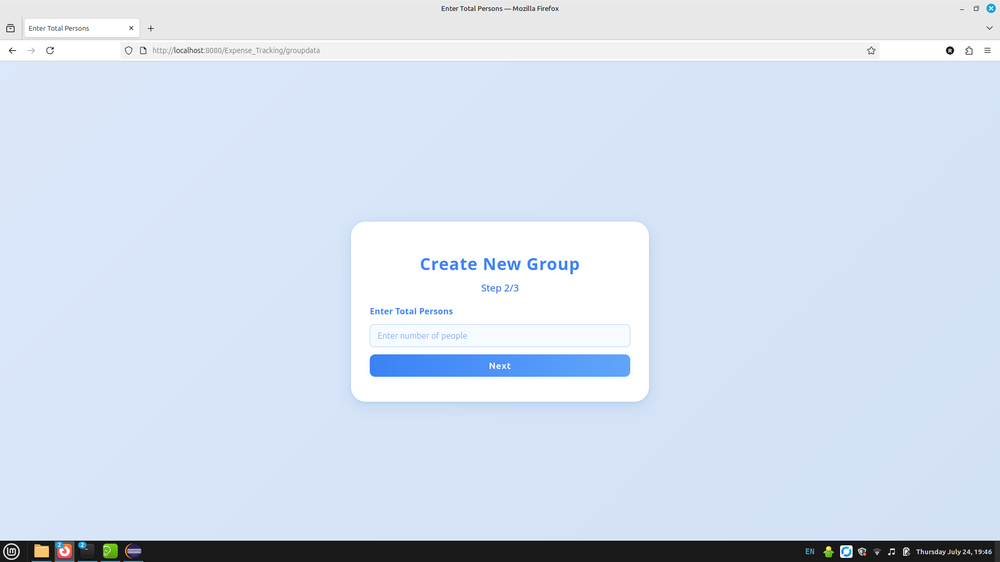
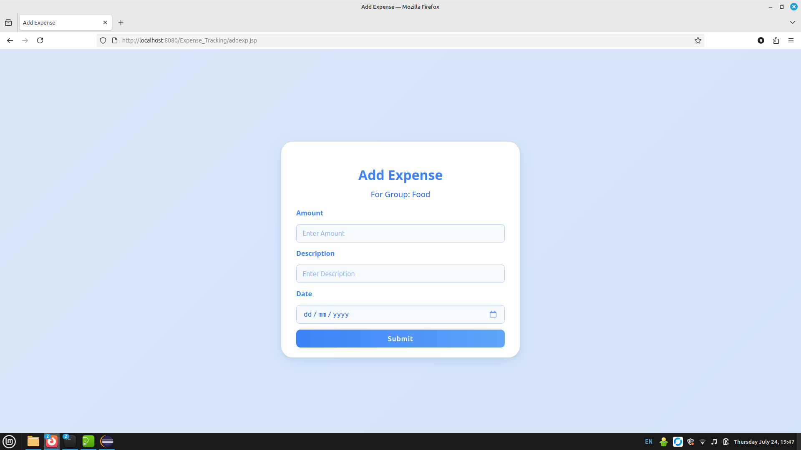
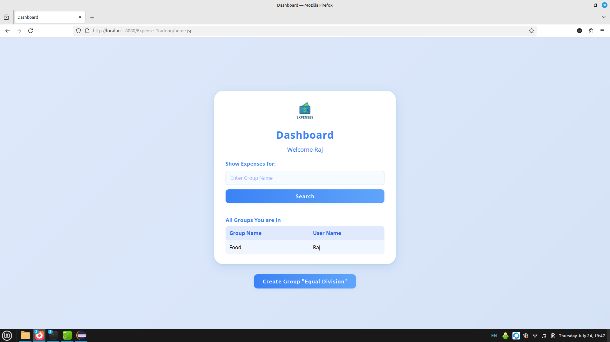
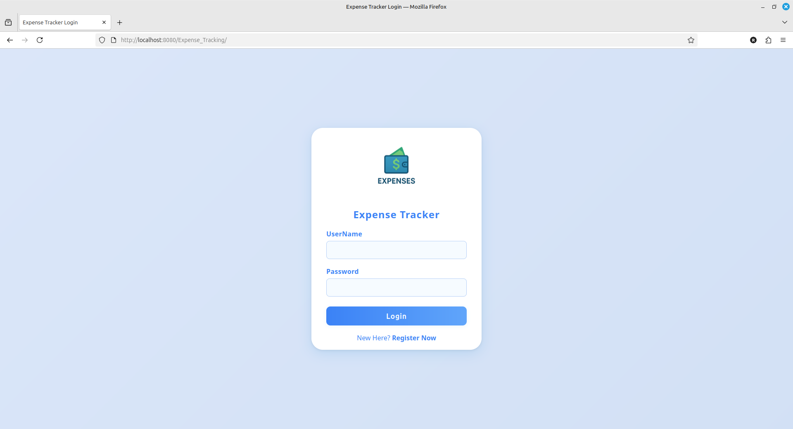
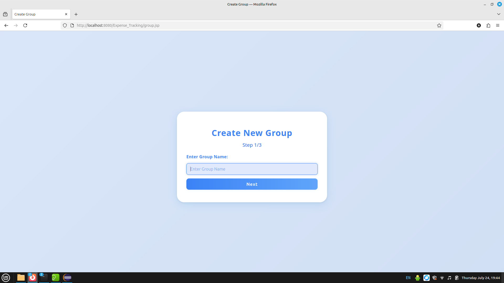
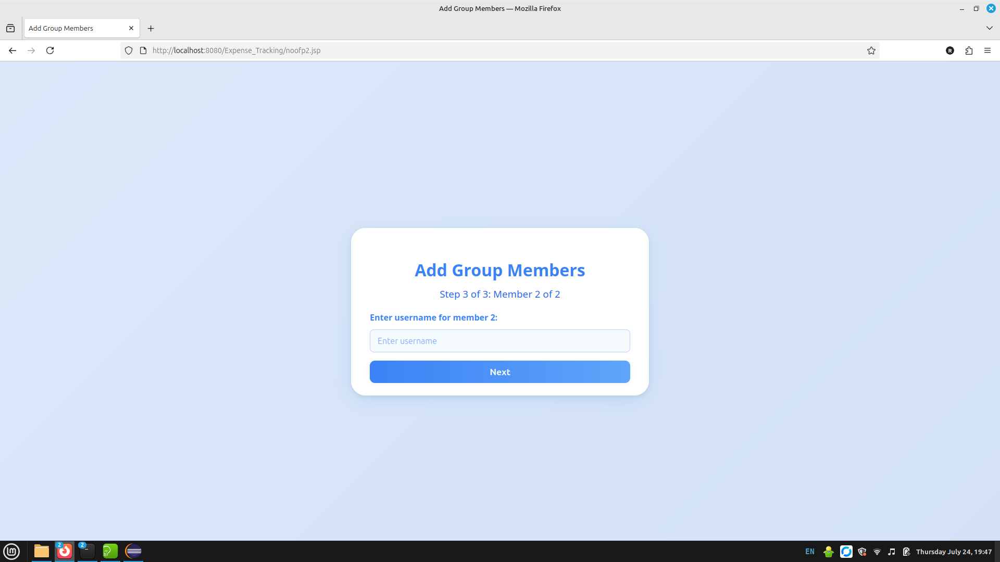
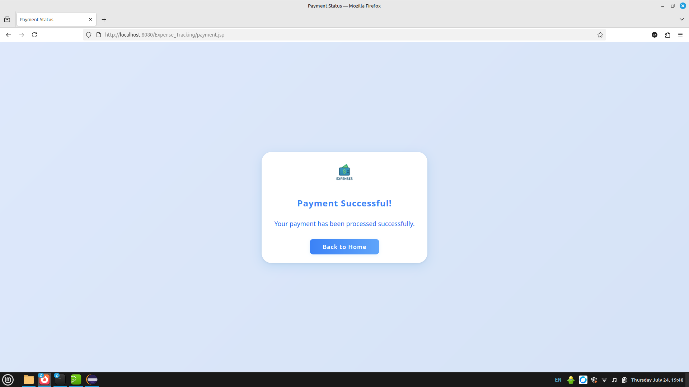
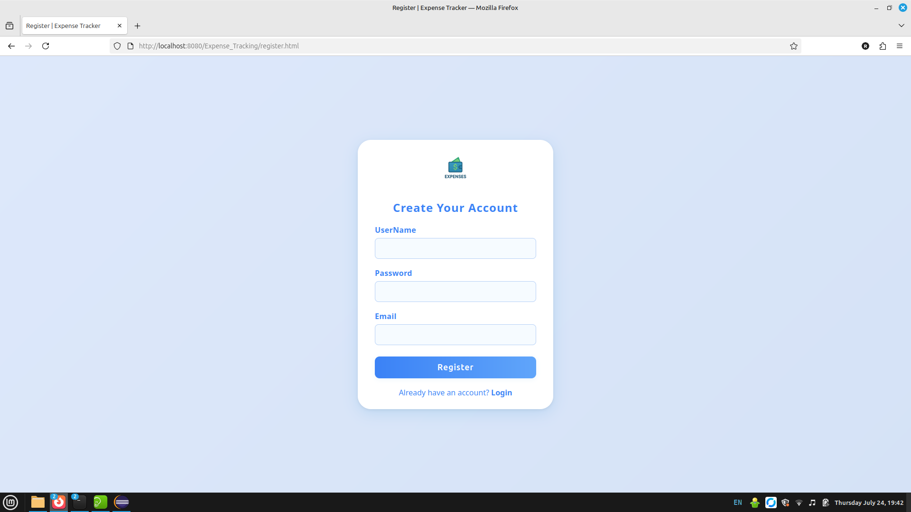
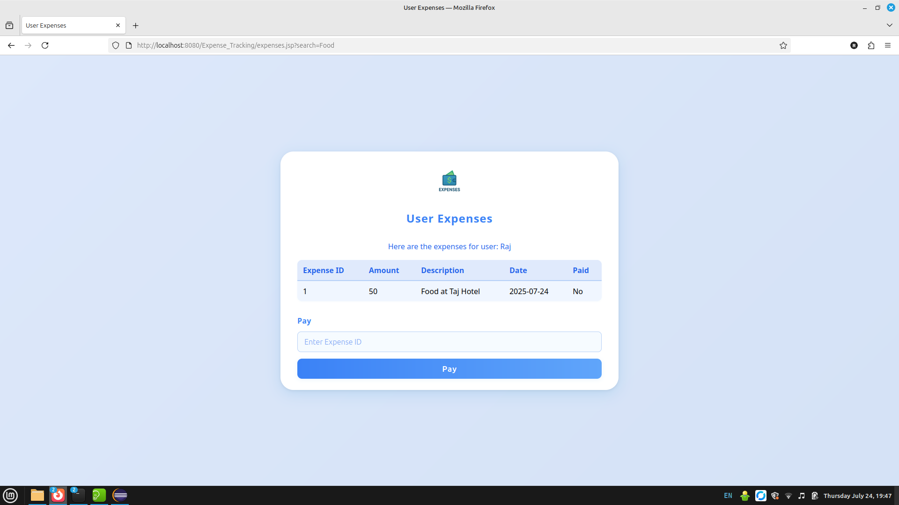

# Expense Tracking Application

## Description

A comprehensive web-based expense tracking application designed with **Java Servlets**, **JSP**, and **MySQL**. This app enables secure user registration, login, group management, expense recording, and payment status updates. The intuitive interface provides efficient management for individual and group expenses, deployed on **Apache Tomcat**.

## Technologies Used

- Java Servlets
- JSP (JavaServer Pages)
- MySQL 8.0
- Apache Tomcat 
- JDBC API
- HTML & CSS (custom styling)

## Features

- User registration and secure login (with password hashing)
- Group creation and member management
- Expense entry, group-wise tracking, editable records
- Payment status update and history viewing
- Secure session management for authenticated access

## Prerequisites

- Java JDK 11 or higher
- Apache Tomcat 9 or 10
- MySQL 8.0 or compatible
- Maven or your preferred IDE (optional)
- Git

## Setup Instructions

1. **Clone the Repository**
https://github.com/RajSarkarIndia/Expense_Tracking

2. **Import Into IDE**
- Open as a Java Dynamic Web Project or as appropriate for your IDE.
3. **Set Up the MySQL Database**
- Create the database `expensesapp`.
- Import the schema using:
  ```
  mysql -u root -p expensesapp < schema.sql
  ```
4. **Configure Database Connection**
- Update `ConnectionClass.java` with your MySQL credentials (`username`, `password`, and DB URL).
5. **Build and Deploy on Tomcat**
- Deploy the generated `.war` file or project folder to your Tomcat's `webapps` directory.
6. **Start Tomcat and Access the App**
http://localhost:8080/Expense_Tracking/


## Usage

- Register a new user account.
- Log in with your credentials.
- Create and manage groups for expense sharing.
- Add, edit, and track expenses by group.
- Update payment status and view payment records.

## Database Schema

The core data structure includes these tables:

| Table         | Description                                      |
|---------------|--------------------------------------------------|
| user          | User info with hashed passwords and unique email  |
| groups        | Collaborative groups for managing shared expenses |
| group_member  | Relationship mapping between groups and users     |
| expenses      | Individual expenses entered by users for each group  |

Refer to `schema.sql` in the repository for full table creation scripts.


## Screenshots

### Create Groups Screen


### Expenses Overview


### Home Page


### Index / Landing Page


### New Group Step 1


### New Group Step 3


### Payment Confirmation


### User Registration


### Show Expenses


## License

MIT License

## Contact

For questions, feedback, or issues, please contact: [Rajsarkar78966new@gmail.com]


